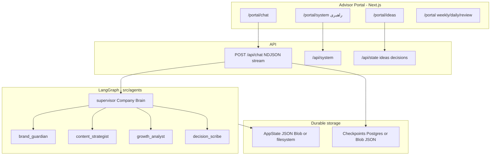

# berlin × kawe

Brand kit and **multi-agent operating system** for **berlin × kawe** ([@berlinxkw](https://instagram.com/berlinxkw)).

Repository layout:

- `Berlin_x_Kawe_Typeface_Kit/` — typography and brand templates (preserved)
- `inspiration for brand/` — reference assets
- `logo.png` — mark (neon lime orb + bear)
- `src/` — **Advisor Portal** (founder control plane) + LangGraph agents

## Architecture

The Advisor Portal is the long-lived **control & steering surface**: strategy (`brainMemory`), Ideas Inbox, decisions, metrics review, and bilingual chat with the OS.



### Agents (`src/agents/`)

| Agent | Role |
|-------|------|
| **supervisor** | Company Brain / CEO — routes specialists, owns final fa/en answer |
| **brand_guardian** | Brand lockup, visual thesis, rejects off-brand work |
| **content_strategist** | Ideas Inbox → experiments/backlog (no posting) |
| **growth_analyst** | Week/daily metrics → measurable priorities |
| **decision_scribe** | `DECISION::` lines + `propose_decision` persistence |

LangChain tools: `get_portal_state`, `list_ideas`, `update_idea_status`, `propose_decision`, `list_decisions`, `get_brand_rules`.

### Checkpoints (no MemorySaver-only production path)

| Env | AppState | LangGraph threads |
|-----|----------|-------------------|
| Local dev | `data/store.json` | `data/langgraph-checkpoints.json` |
| Vercel + Blob | `berlinxkw/store.json` | `berlinxkw/langgraph-checkpoints.json` |
| `DATABASE_URL` (Neon, etc.) | Blob/filesystem as above | **Postgres** via `@langchain/langgraph-checkpoint-postgres` |

`thread_id` defaults to portal **session id** for durable advisor threads.

### Observability (optional)

- **LangSmith:** set `LANGCHAIN_TRACING_V2=true`, `LANGSMITH_API_KEY`, `LANGSMITH_PROJECT=berlinxkw` (see [LangSmith + Next.js](https://docs.langchain.com/langsmith/deploy-nextjs)).
- **Langfuse:** set `LANGFUSE_PUBLIC_KEY` + `LANGFUSE_SECRET_KEY` (handler loads when compatible package is present).

Chat works with **OpenAI only** — tracing keys are not required locally.

## Run locally

```bash
npm install
cp .env.example .env.local
# Add OPENAI_API_KEY
npm run dev
```

Open [http://localhost:3000](http://localhost:3000). Default passcode: `berlinxkw` (override with `PORTAL_PASSCODE`).

## Environment variables

| Variable | Required | Description |
|----------|----------|-------------|
| `OPENAI_API_KEY` | For chat | OpenAI key for LangGraph agents |
| `OPENAI_CHAT_MODEL` | Optional | Default `gpt-4o-mini` |
| `PORTAL_PASSCODE` | Recommended | Advisor login passcode |
| `BLOB_READ_WRITE_TOKEN` | Production | Vercel Blob for AppState + checkpoint JSON |
| `DATABASE_URL` | Optional | Postgres checkpointer for durable threads |
| `LANGCHAIN_TRACING_V2` / `LANGSMITH_*` | Optional | LangSmith traces (tagged with thread/week) |
| `LANGFUSE_*` | Optional | Secondary tracing |

Copy from [`.env.example`](.env.example).

## Deploy on Vercel

1. Import this repo (root = repository root).
2. Set `OPENAI_API_KEY` and `PORTAL_PASSCODE`.
3. Add **Blob** storage for AppState + checkpoints, **or** attach Neon and set `DATABASE_URL` for Postgres checkpoints.
4. Agent routes use **Node.js** runtime (`export const runtime = "nodejs"`).

## App routes

| Path | Purpose |
|------|---------|
| `/login` | Passcode gate |
| `/portal` | Weekly report |
| `/portal/daily` | Daily metric snapshots |
| `/portal/review` | Evaluate prior-week decisions |
| `/portal/ideas` | **Ideas Inbox** — founder drops for agents |
| `/portal/chat` | LangGraph streaming OS (Persian-friendly) |
| `/portal/system` | **راهبری** — agents, storage/tracing status, edit `brainMemory` |

### Chat API

`POST /api/chat` — NDJSON stream: `{ type: "token" | "agent" | "done" | "error", ... }`.  
Body: `{ message, sessionId, weekId, threadId? }`.

Instagram posting/automation remains **out of scope**.

## Type tokens

UI imports [`Berlin_x_Kawe_Typeface_Kit/07_Tokens/type-tokens.css`](Berlin_x_Kawe_Typeface_Kit/07_Tokens/type-tokens.css). Accent `--bk-lime` matches the logo orb.
