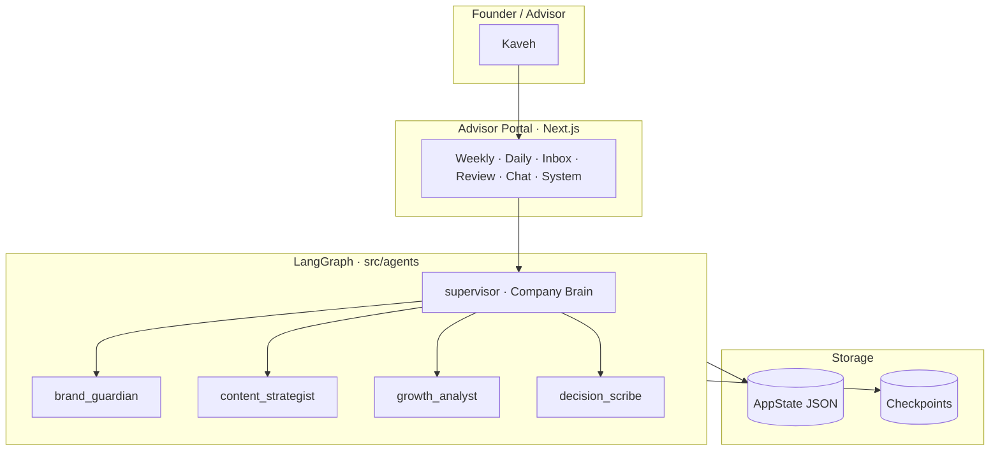

# berlin × kawe

**Brand kit + multi-agent operating system** for [@berlinxkw](https://instagram.com/berlinxkw).  
*کیت برند + سیستم‌عامل چندعامله*

| | |
|---|---|
| **Live portal** | [https://berlinxkw.vercel.app](https://berlinxkw.vercel.app) *(set when deployed)* |
| **Founder surface** | Advisor Portal — strategy, inbox, chat, review |
| **Instagram** | Posting / automation **paused** (by design) |

---

## What lives in this repo

1. **`Berlin_x_Kawe_Typeface_Kit/`** — typography, lockups, social templates, [type tokens](Berlin_x_Kawe_Typeface_Kit/07_Tokens/type-tokens.css). See [Brand kit README](Berlin_x_Kawe_Typeface_Kit/README.md) and [راهنمای فارسی](Berlin_x_Kawe_Typeface_Kit/README_FA.md).
2. **`src/`** — **Advisor Portal** (Next.js) + **LangGraph** Company Brain (supervisor + 4 specialists).
3. **`inspiration for brand/`**, **`logo.png`** — reference assets and mark.

Always write the name **berlin × kawe** with the multiplication sign **×**, never the letter `x`.

---

## Architecture (one screen)



**Deeper reading:** [Architecture](docs/ARCHITECTURE.md) · [Workflows](docs/WORKFLOWS.md) · [Portal tour](docs/PORTAL_GUIDE.md)

---

## Quick start

1. **Clone & install**
   ```bash
   git clone https://github.com/kvmmn/_berlinxkw.git && cd _berlinxkw
   npm install
   ```
2. **Configure env** — `cp .env.example .env.local` and set `OPENAI_API_KEY` (required for chat).
3. **Run locally** — `npm run dev` → [http://localhost:3000](http://localhost:3000).
4. **Log in** — default passcode `berlinxkw` (override with `PORTAL_PASSCODE`).
5. **Steer the OS** — drop ideas at `/portal/ideas`, chat at `/portal/chat`, edit strategy on `/portal/system`.

Production: see [Deploy / env checklist](docs/WORKFLOWS.md#e-deploy--environment) in the workflows doc.

---

## Documentation map

| Doc | Purpose |
|-----|---------|
| [docs/ARCHITECTURE.md](docs/ARCHITECTURE.md) | Layers, agents, storage, observability |
| [docs/WORKFLOWS.md](docs/WORKFLOWS.md) | Daily OS, inbox, chat, weekly review, deploy |
| [docs/PORTAL_GUIDE.md](docs/PORTAL_GUIDE.md) | Route-by-route tour (EN + FA one-liner) |
| [Berlin_x_Kawe_Typeface_Kit/README.md](Berlin_x_Kawe_Typeface_Kit/README.md) | Brand typography & templates |

---

## UI tokens

Portal UI imports [`Berlin_x_Kawe_Typeface_Kit/07_Tokens/type-tokens.css`](Berlin_x_Kawe_Typeface_Kit/07_Tokens/type-tokens.css). Accent `--bk-lime` matches the logo orb.

---

## License & contact

Private operating repo for berlin × kawe. Questions: open an issue or contact the maintainer.
