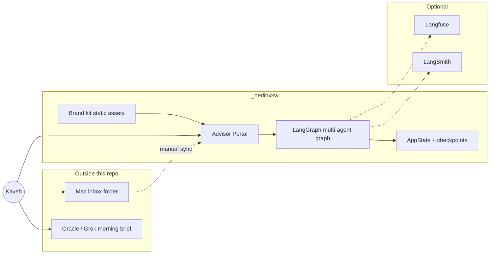
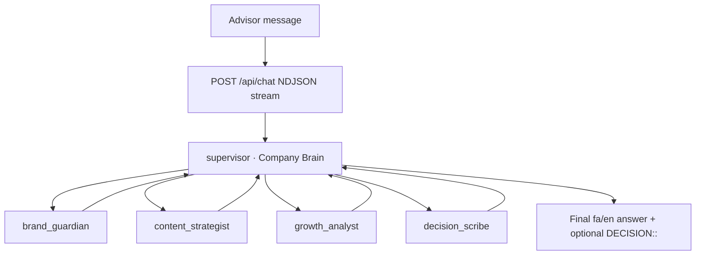
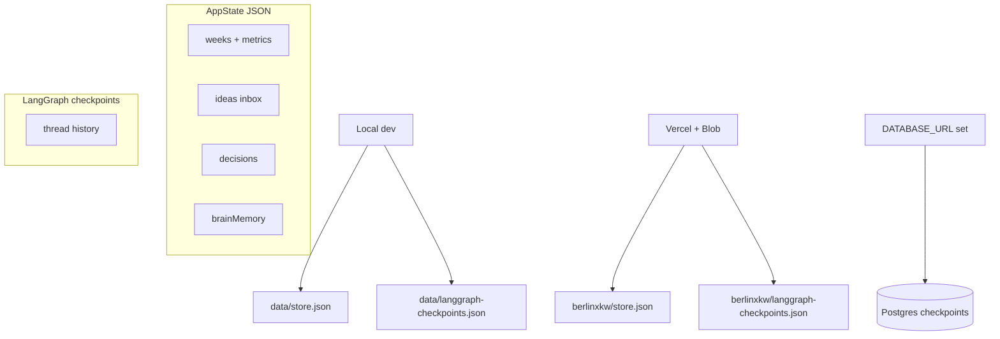

# Architecture

*معماری سیستم — layers in plain language*

This document explains how **berlin × kawe OS** fits together: brand assets, the Advisor Portal, LangGraph agents, storage, and optional tracing. A new contributor should read this in ~5 minutes.

---

## System context

*زمینه کلی*



| Piece | Role |
|-------|------|
| **Brand kit** | SVG/PDF templates, lockups, CSS/JSON type tokens — no runtime logic |
| **Advisor Portal** | Founder **control plane**: metrics, ideas, decisions, chat, `brainMemory` |
| **LangGraph** | **Company Brain** routes four specialists; tools read/write portal state |
| **Storage** | Durable JSON for business state + conversation checkpoints |
| **Oracle / Grok Bot** | External daily Persian brief — **not in this repo**; complements portal |
| **Mac `inbox/`** | Local drop folder for founder; ideas land in portal via manual entry or future sync |

---

## Layer 1 — Brand kit

*لایه برند*

Path: `Berlin_x_Kawe_Typeface_Kit/`

Static design system: lockup **berlin × kawe** (true **×**), Nimbus/Vazirmatn stacks, social sizes, charts. Portal imports `07_Tokens/type-tokens.css` for UI consistency.

Agents enforce the same rules via `get_brand_rules` (`src/agents/brand.ts`).

---

## Layer 2 — Advisor Portal

*پورتال مشاور — control plane*

Next.js 15 app under `src/app/`. Passcode gate (`PORTAL_PASSCODE`). Routes under `/portal/*` — see [PORTAL_GUIDE.md](PORTAL_GUIDE.md).

**AppState** (weeks, metrics, ideas, decisions, `brainMemory`) is loaded/saved through `src/lib/storage.ts` and exposed to agents via API + tools.

---

## Layer 3 — LangGraph multi-agent graph

*گراف چندعامله*



Implementation: `src/agents/graph.ts` — `createSupervisor` + four `createReactAgent` specialists.

### Agents

| ID | EN | FA | Responsibility |
|----|----|----|----------------|
| `supervisor` | Company Brain (CEO) | مغز شرکت | Route specialists, own final answer |
| `brand_guardian` | Brand Guardian | نگهبان برند | Lockup, visual thesis, reject off-brand |
| `content_strategist` | Content Strategist | استراتژیست محتوا | Inbox → experiments/backlog (no posting) |
| `growth_analyst` | Growth Analyst | تحلیل‌گر رشد | Week/daily metrics → priorities |
| `decision_scribe` | Decision Scribe | منشی تصمیم | `DECISION::` lines + `propose_decision` |

### Tools (`src/agents/tools/portal-tools.ts`)

| Tool | Used by |
|------|---------|
| `get_portal_state` | All (context) |
| `get_brand_rules` | brand_guardian |
| `list_ideas`, `update_idea_status` | content_strategist |
| `list_decisions`, `propose_decision` | decision_scribe |

**Chat contract:** `POST /api/chat` — NDJSON `{ type: "token" \| "agent" \| "done" \| "error", ... }`. Body: `{ message, sessionId, weekId, threadId? }`. `thread_id` defaults to session id for durable threads.

---

## Layer 4 — Storage

*ذخیره‌سازی*



| Concern | Local dev | Production (typical) |
|---------|-----------|----------------------|
| **AppState** | `data/store.json` | Vercel Blob `berlinxkw/store.json` |
| **Checkpoints** | `data/langgraph-checkpoints.json` | Blob JSON **or** Postgres via `@langchain/langgraph-checkpoint-postgres` |

Postgres is **preferred** for durable chat threads when `DATABASE_URL` is set. Pure in-memory checkpointing is not the production path — see `src/agents/checkpointer.ts`.

Seed data: `data/seed.json`.

---

## Layer 5 — Observability

*مشاهده‌پذیری — optional*

| System | Env hints | Notes |
|--------|-----------|--------|
| **LangSmith** | `LANGCHAIN_TRACING_V2`, `LANGSMITH_API_KEY`, `LANGSMITH_PROJECT` | Default project `berlinxkw`; see [LangSmith + Next.js](https://docs.langchain.com/langsmith/deploy-nextjs) |
| **Langfuse** | `LANGFUSE_PUBLIC_KEY`, `LANGFUSE_SECRET_KEY`, optional `LANGFUSE_BASE_URL` | Secondary observer via `@langfuse/langchain` |

Chat works with **OpenAI only** — tracing keys are not required locally. Status visible on `/portal/system`.

Config helpers: `src/agents/observability.ts`.

---

## Layer 6 — Daily OS routine (external)

*روال روزانه — خارج از ریپو*

1. **Morning brief** — Oracle / Grok Bot delivers a **Persian** operating summary (external automation).
2. **Founder checks** — Mac `inbox/` folder (if used) + portal **Ideas Inbox** + optional `/portal/daily` pulse.
3. **No Instagram post** — posting remains paused; strategists plan experiments only.

Detailed steps: [WORKFLOWS.md](WORKFLOWS.md).

---

## Repository layout (runtime)

```
src/
  agents/          LangGraph graph, prompts, checkpointer, tools
  app/             Next.js pages + API routes
  components/      Portal UI
  lib/             storage, auth, types, brain context
Berlin_x_Kawe_Typeface_Kit/   brand assets
data/              seed + local store (dev)
```

Agent API routes use **Node.js** runtime (`export const runtime = "nodejs"`).
