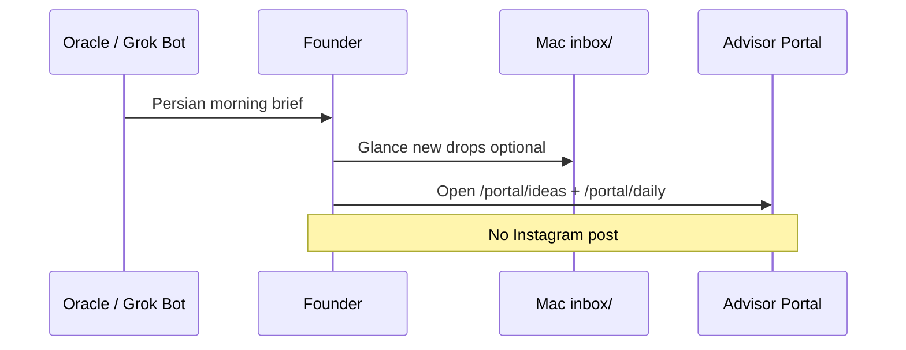
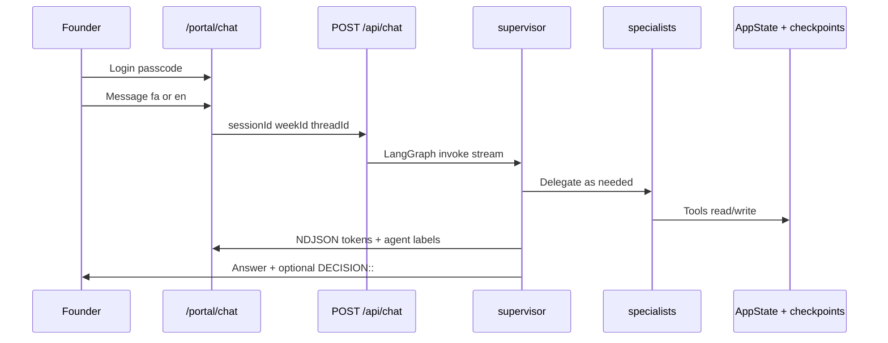
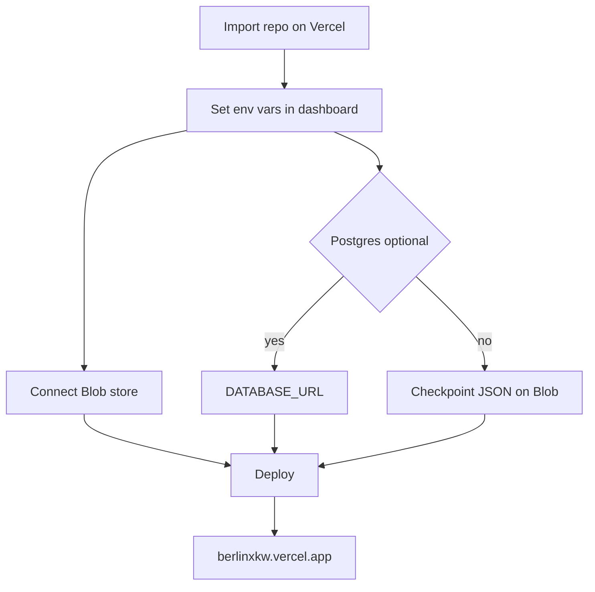

# Workflows

*جریان‌های کاری — step-by-step*

Numbered flows for how Kaveh (founder) and contributors use **berlin × kawe OS**. Instagram automation is **out of scope / paused**.

---

## A. Daily morning OS

*روال صبحگاهی*

**Goal:** Start the day with context in Persian, scan inputs, **no** Instagram publish.



| Step | Action |
|------|--------|
| 1 | Read the **external** Persian brief (Oracle / Grok Bot — not in this repo). |
| 2 | Skim local **`inbox/`** on Mac if you use it; capture anything missing in the portal. |
| 3 | Open **Ideas Inbox** (`/portal/ideas`) — review `inbox` / `queued` items. |
| 4 | Optional: **Daily pulse** (`/portal/daily`) — demo metric snapshots while IG is paused. |
| 5 | If you need steering, open **Company Brain** (`/portal/chat`) for a short fa/en check-in. |
| 6 | **Do not** post to Instagram — strategists only plan backlog/experiments. |

---

## B. Drop an idea

*ثبت ایده*

**Goal:** Capture founder creative fuel where agents can read it.

```mermaid
flowchart LR
  A[Capture] --> B{Channel?}
  B -->|Web| C[/portal/ideas]
  B -->|Mac| D[inbox/ folder]
  D --> E[Manual add or future sync]
  E --> C
  C --> F[AppState ideas[]]
  F --> G[Agents via list_ideas]
```

| Step | Action |
|------|--------|
| 1 | **Portal:** go to `/portal/ideas`. |
| 2 | Add **title**, description, optional **image/video** upload. |
| 3 | Status defaults to **`inbox`** (or set `queued` when ready for agents). |
| **Alt** | Drop files/notes in Mac **`inbox/`** — then transcribe or upload via portal so Company Brain sees them. |
| 4 | Agents pull inbox/queued items via `get_portal_state` / `list_ideas` during chat. |

API: `GET/POST /api/ideas`, `PATCH /api/ideas/[id]`.

---

## C. Chat with Company Brain

*گفتگو با مغز شرکت*

**Goal:** Bilingual advisory session with specialist routing and optional decisions.



| Step | Action |
|------|--------|
| 1 | Visit `/login` — enter `PORTAL_PASSCODE`. |
| 2 | Open **`/portal/chat`**. |
| 3 | Ask in **Persian or English** (priorities, brand check, inbox ideas). |
| 4 | Watch stream for **agent** events (which specialist ran). |
| 5 | If output includes **`DECISION:: …`**, review in weekly flow or decisions API. |
| 6 | **`decision_scribe`** may call `propose_decision` — evaluate later on `/portal/review`. |

Requires `OPENAI_API_KEY`. Threads persist via checkpoint backend (Blob or Postgres).

---

## D. Weekly review cycle

*چرخه بازبینی هفتگی*

**Goal:** Read the week, score decisions, steer long-term memory.

```mermaid
flowchart TB
  W[Open /portal weekly report] --> R[Read summary + metrics]
  R --> V[/portal/review]
  V --> S[Score decisions 1-5 + notes]
  S --> SYS[/portal/system]
  SYS --> BM[Edit brainMemory save]
  BM --> N[Next week chat context]
```

| Step | Action |
|------|--------|
| 1 | **`/portal`** — read current **weekly report** (metrics + narrative). |
| 2 | **`/portal/review`** — score **unevaluated decisions** from the prior week. |
| 3 | Add **notes** — they feed next week's brain context. |
| 4 | **`/portal/system`** — update **`brainMemory`** (strategy steering doc). |
| 5 | Save — persists to AppState (Blob/filesystem). |
| 6 | Optional: chat on **`/portal/chat`** to stress-test new `brainMemory`. |

---

## E. Deploy / environment

*استقرار و متغیرهای محیط*

**Goal:** Ship portal to Vercel without pasting secrets into docs or git.



### Checklist

| Step | Task |
|------|------|
| 1 | Import **`kvmmn/_berlinxkw`** — project root = repo root. |
| 2 | Set **`OPENAI_API_KEY`** (Production + Preview as needed). |
| 3 | Set **`PORTAL_PASSCODE`** — strong founder-only passcode. |
| 4 | Enable **Vercel Blob** → `BLOB_READ_WRITE_TOKEN` (AppState + checkpoint JSON). |
| 5 | *(Recommended)* Attach **Neon** (or Postgres) → **`DATABASE_URL`** for durable chat threads. |
| 6 | *(Optional)* LangSmith: `LANGCHAIN_TRACING_V2`, `LANGSMITH_API_KEY`, `LANGSMITH_PROJECT=berlinxkw`. |
| 7 | *(Optional)* Langfuse: `LANGFUSE_PUBLIC_KEY`, `LANGFUSE_SECRET_KEY`. |
| 8 | Run **`npm run build`** locally before merge; Vercel uses the same. |
| 9 | Point custom domain or use default **`https://berlinxkw.vercel.app`**. |

Copy variable **names** from [`.env.example`](../.env.example) — never commit `.env.local` or paste keys into GitHub.

### Local parity

```bash
npm install
cp .env.example .env.local
# fill OPENAI_API_KEY
npm run dev
```

Default dev passcode: `berlinxkw` unless overridden.
